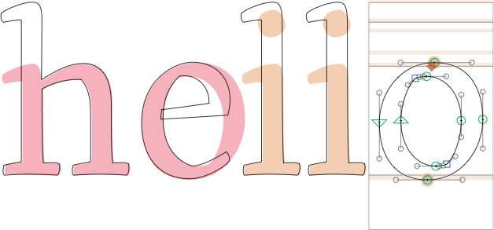

# ShowAllBackgrounds.glyphsReporter

This is a plugin for the [Glyphs font editor](https://glyphsapp.com/) by Georg Seifert.

It displays the background layers of inactive glyphs in Edit view, i.e., all glyphs except the one currently open for editing. It displays paths in a pinkish color, components in a pastel orange. It works best if you disable *View > Fill Preview*.

### Installation

1. In *Window > Plugin Manager*, click the *Install* button next to the *ShowAllBackgrounds* entry.
2. Restart Glyphs

or:

1. Download the complete ZIP file and unpack it, or clone the repository.
2. Double click the .glyphsReporter file. Confirm the dialog that appears in Glyphs.
3. Restart Glyphs.

### Usage Instructions

1. Open a few glyphs in Edit view.
2. Use *View > Show All Backgrounds* (de: *Zeige alle Hintergründe*, Cmd-^ on a German keyboard) to toggle the display of backgrounds of other glyphs than the current one.
3. Toggle *View > Fill Preview* for a less obstructed look at the backgrounds.

### Requirements

The plugin has only been tested in app version 2.4.1 (976) and it may not run in earlier versions.

### License

Copyright 2017 Rainer Erich Scheichelbauer (@mekkablue).
Including sample code by Georg Seifert (@schriftgestalt) and Jan Gerner (@yanone).

Licensed under the Apache License, Version 2.0 (the "License");
you may not use this file except in compliance with the License.
You may obtain a copy of the License at

http://www.apache.org/licenses/LICENSE-2.0

See the License file included in this repository for further details.
